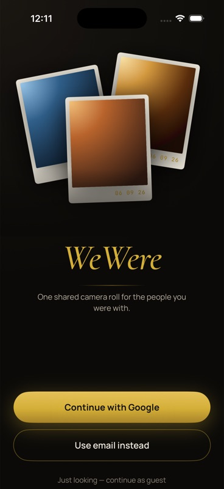
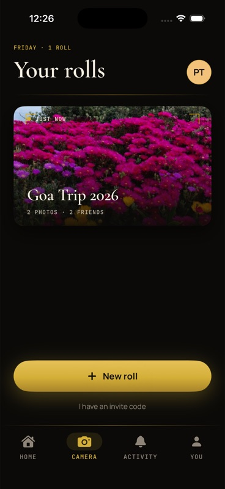
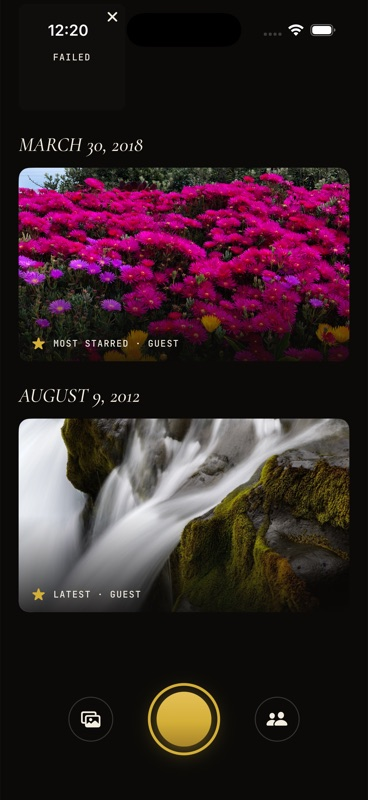
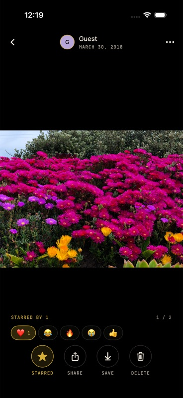
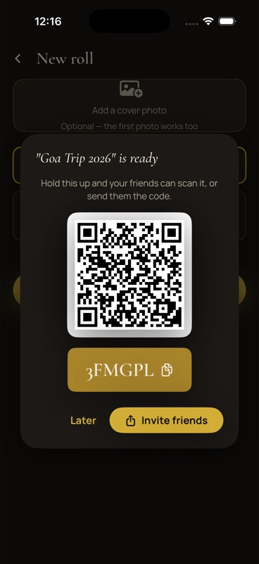
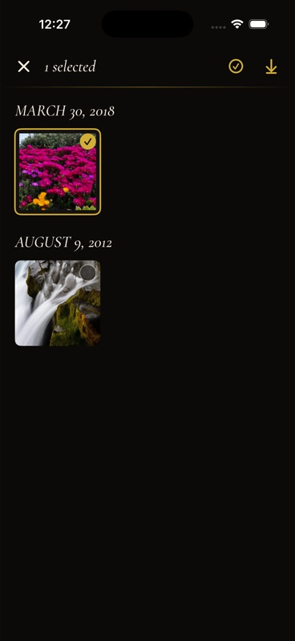
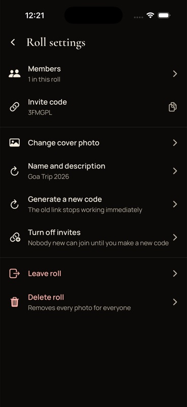
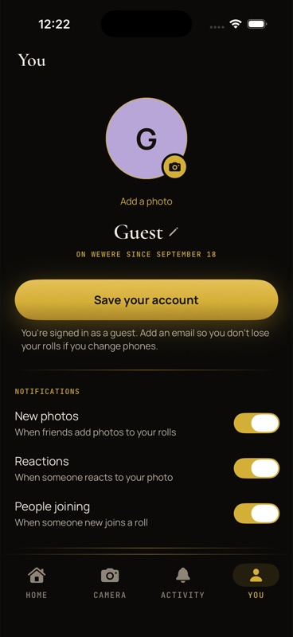

<p align="center">
  
</p>

<h1 align="center">WeWere</h1>

<p align="center"><b>One shared camera roll for the people you were with.</b></p>

<p align="center">
  <a href="https://wewere.vercel.app">Website</a> ·
  <a href="https://wewere.vercel.app/WeWere-1.0.3.apk">Android 1.0.3</a> ·
  <a href="https://wewere.vercel.app/#ios">iPhone 1.0.3</a>
</p>

<p align="center">
  <a href="https://wewere.vercel.app"></a>
</p>

Start a roll for the trip, the wedding, the flat. Everyone in it shoots straight from
the app or adds from their gallery, and everyone else sees the photo within seconds —
so the week afterwards, nobody has to chase eight people for the good ones.

- **Free.** No ads, no subscriptions, no card anywhere in the stack.
- **Private.** A roll is visible only to the people who were handed its code. No feed,
  no followers, no discovery.
- **Two native apps, one roll.** Android (7.0+) in Kotlin and Jetpack Compose;
  iPhone (iOS 17+) in Swift and SwiftUI. Same account, same rolls, same design on both.
- **Black and gold.** Cormorant Garamond for titles, Manrope for body, JetBrains Mono
  for camera-style readouts. Film sprockets, gold hairlines, photos that develop from
  a blur the way a print comes up in the tray.

---

## A look inside

<p align="center">
  
  
  
  
</p>
<p align="center">
  
  
  
  
</p>

---

## How it works

**Open a roll.** Name it, give it a cover if you like. That's the whole setup — the
first photo becomes the cover otherwise.

**Hold up the code.** Every roll has a six-character invite code and a QR. Friends
scan it, type it, or tap a `wewere.vercel.app/join/CODE` link, and they're in. No
phone numbers, no contacts access.

**Everyone shoots into it.** Take photos straight from the app or add up to a hundred
from your gallery. Everyone else sees them within seconds — and if you lose signal,
the upload waits and finishes on its own later.

## What's inside

| | |
|---|---|
| **Camera** | Shoot in, don't upload later. Tap-to-focus, pinch zoom, flash, a self-timer and a rule-of-thirds grid. |
| **Timeline** | Grouped by the day a photo was *taken*, not uploaded. Each day opens on its most-starred shot. |
| **Stars** | Mark the keepers. Filter any roll down to what people starred, or to one person's photos. |
| **Reactions** | Five of them. No comment threads, no view counts — this is not a social network. |
| **Save & share** | Full resolution, yours. Save any photo — or a whole selection — to your gallery, or share it anywhere. |
| **Slideshow** | Prop the phone up. It keeps the screen awake and stops at the end rather than looping. |
| **Offline** | Uploads queue on the device and survive airplane mode, a dead battery and a force-quit. |
| **Sign-in** | Google, email, or just look around as a guest and save your account later — your rolls come with you. |
| **Admin** | Rename, change the cover, remove someone, regenerate or turn off the invite, delete the roll. The last person out deletes it automatically. |

Deliberately not built: shared albums, trip detection, AI highlights, memory videos,
comments, expiring rolls.

---

## Privacy

Worth being precise about, because the honest answer has a caveat.

**The database is properly locked down.** Every read of a roll, its photos, its members
and its activity is checked on the server against your membership; the app cannot
influence that check. Someone who is not in a roll cannot read anything about it,
cannot list it, and cannot find it. Invite codes resolve through a separate lookup that
exposes only a name and two counts, and listing codes is denied outright — the code
itself is the secret.

**Every photo is re-encoded on the phone before it leaves.** That strips the metadata —
GPS coordinates, device model, the original timestamp — so a photo someone saves and
forwards carries nothing about where you were standing. The time it was taken is kept
separately, inside the roll, where it belongs.

**The app never asks to read your photo library.** Adding from your gallery uses the
system picker on both platforms, so WeWere only ever sees the photos you choose.

**The caveat:** photo links inside a roll are long-lived signed URLs, so images load
instantly and share cleanly. Anyone holding the exact link can open that one image
without signing in — the same trade every photo-sharing app makes. The links live only
inside your roll; they don't leak on their own.

### Permissions, and the ones deliberately absent

| Permission | Asked when |
|---|---|
| Camera | the first time you tap the camera, with the reason on screen first |
| Notifications (Android) | after you are signed in and have a roll, not at launch |
| Add to Photos (iPhone) / write storage (old Android) | the first time you save a photo |

Not requested, ever: contacts, location, or read access to your photo library.

---

## Under the hood

Both apps are built the same way, layer for layer, so a fix in one is a known change in
the other:

```
ui / UI          screens + view models — knows nothing about the backend
domain / Domain  plain models, repository interfaces (the seam), timeline sectioning
data / Data      the Firebase and Supabase implementations, the durable upload queue
core / Core      Outcome, AppError, error mapping, time formatting, invite codes
```

| | Android | iPhone |
|---|---|---|
| UI | Jetpack Compose, Material 3 | SwiftUI |
| Reactive layer | Kotlin Flows | Combine |
| Upload queue | Room + WorkManager | JSON store + a draining task with backoff |
| Camera & QR | CameraX, ML Kit | AVFoundation |
| Images | Coil | Kingfisher |
| Backend | Firebase Auth + Firestore (realtime, offline cache), Supabase Storage for the bytes | same |

A few decisions worth knowing about:

- **Errors are translated at the boundary.** The UI never sees a raw exception, only a
  small set of typed errors — which is why every error state is a real sentence.
- **Pagination is a growing realtime window**, not cursor pages. A shared roll gains
  photos at the top constantly; cursor pages would duplicate or skip rows every time a
  friend uploaded mid-scroll.
- **The upload queue is durable.** A photo is marked complete only once its database
  document exists, so a crash between the bytes landing and the document being written
  retries safely instead of leaving an image nobody can see.
- **Timeline sections cut on capture time.** Everyone empties their camera roll at the
  hotel that night; sectioning by upload time would file a whole week under one heading.
- **Security rules are tested against the emulator**, including the batched writes the
  app actually performs — Firestore evaluates each write in a batch against the state
  *before* the batch, which is the kind of thing that only shows up under test.

## Status

| Check | Result |
|---|---|
| Android build, unit tests, lint | pass — release APK 26 MB, signed and minified; 26 tests, 0 lint errors |
| Firestore security rules suite | **46 passed**, 0 failed |
| iOS build (simulator and device) | pass — release build 8.6 MB zipped |
| Android on a phone | sign-in, create roll, upload, view, star — verified on a OnePlus (Android 16) against the live backend |
| iPhone in the simulator | sign-in, create roll, upload, timeline, viewer, reactions, stars, invites by code and link, members, settings, save to Photos, slideshow — against the live backend |

All three suites run in CI on every push. Still to do on hardware: the iPhone camera
itself, QR scanning and Google's sign-in sheet, which the simulator cannot exercise.

## Known gaps

- **Counters are client-maintained**, under rules that cap each change at ±1. A
  malicious member could nudge a count; they cannot touch anything else.
- **Group deletion is not atomic.** Firestore has no recursive delete from a client, so
  it walks the subcollections in batches; an interruption can leave a partially deleted
  roll.
- **No push notifications yet.** The preferences exist; delivery needs a paid tier on
  both platforms' side.
- **iPhone installs are sideloaded** (AltStore or Sideloadly) until there's an Apple
  Developer account behind the app — Apple only allows tap-to-install through one.
- **Invite codes exclude `O`, `I`, `S`, `0`, `1` and `5`** on purpose: codes get read
  off someone else's screen, and dropping the confusable characters is worth more than
  a bigger alphabet.

---

<p align="center">Made with ❤️ by <a href="https://wewere.vercel.app/#about">sidhY4rth</a></p>
